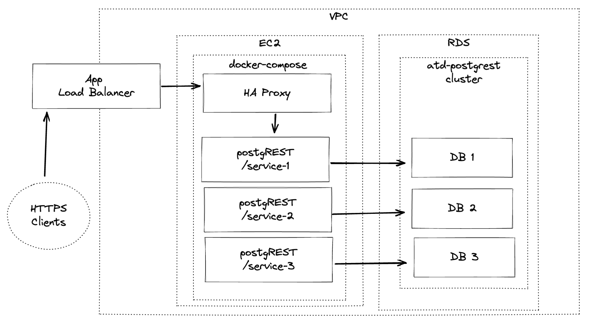

# atd-postgrest



This repository contains configuration files for orchestrating Austin Transportation's [PostgREST](https://postgrest.org/) services.

## Table of contents

- [atd-postgrest](#atd-postgrest)
  - [Table of contents](#table-of-contents)
  - [Design](#design)
  - [Services](#services)
  - [Configuration](#configuration)
    - [Environment variables](#environment-variables)
    - [Docker](#docker)
    - [HAProxy](#haproxy)
    - [`haproxy/config/haproxy.cfg`](#happroxyconfighaproxycfg)
    - [`haproxy/maps/routes.map`](#happroxymapsroutesmap)
  - [Get it running](#get-it-running)
  - [Deployment](#deployment)
  - [Maintenance](#maintenance)

## Design

ATD relies on multiple postgREST services. These services are fronted by a single [HAProxy](http://www.haproxy.org/) load balancer, which functions as a reverse proxy to route requests to each postgREST instance.

The root endpoint is available at [http://atd-postgrest.austinmobility.io/](http://atd-postgrest.austinmobility.io/).

## Services

| name            | repo                                                                       | route               |
| --------------- | -------------------------------------------------------------------------- | ------------------- |
| knack services  | [atd-knack-services](https://github.com/cityofaustin/atd-knack-services)   | `/knack-services/`  |
| legacy scripts  | [atd-data-deploy](https://github.com/cityofaustin/atd-data-deploy)         | `/legacy-scripts/`  |
| parking         | [atd-parking-data](https://github.com/cityofaustin/atd-parking-data)       | `/parking/`         |
| road conditions | [atd-road-conditions](https://github.com/cityofaustin/atd-road-conditions) | `/road-conditions/` |

## Configuration

### Environment variables

Because each of the services's databases are hosted in the same RDS cluster, the following environment variables are applied to all postgREST services.

- `PG_HOST`: the postgres server host name
- `PG_USER`: the postgres user name
- `PG_PASSWORD`: the postgres password
- `PGREST_MAX_ROWS`: the maximum rows to be returned by a postgREST request

As well, each postgREST service requires a unique (32-char minimum) JWT secret. The var can be named as you wish, and must be referenced in `docker-compose.yaml` (look there for example).

The environment file *must* be named `.env` and stored in the root of the repository. This will ensure that variables are properly interopolated into the docker-compose envirnoment. The variable values can be sourced from 1Password in the `atd-postgrest` entry of the developer vault. 

### Docker

Each postgREST service must be defined in `docker-compose.yaml`. The service name defined in the compose yaml wil be referenced as a host in the HA proxy config.

### HAProxy

A dockerized HAProxy service reverse-proxy routing to the available postgREST instances.

### `happroxy/config/haproxy.cfg`

This file defines the HAProxy configuration. Each "backend" postgREST service must be fined here. See the comments in that file for details.

### `happroxy/maps/routes.map`

This filed defines which how an inbound HTTP request's path will be mapped to the various backend postgREST services. See the comments in that file for details.

## Get it running

1. Modify `docker-compose.yaml`, `haproxy.cfg`, and `routes.map` as needed.
2. Create an environment file in the root directory. Name it `env`.
3. Start the services: `$ docker-compose up -d`

## Deployment

Access to the production postgREST endpoints is restricted to COA IP addresses. Docker is configured on the production server to restart on boot.

The script `/scripts/docker-keepalive.sh` checks if the HAProxy service is running, and restarts all containers if not. This script is deployed to the prod server's crontab to run every hour.

You can inspect the crontab with `sudo crontab -l`.

## Maintenance

Any changes to this repository must be manually pulled on the prod server.

If you make changes to the schema, permissions, or secrets of any of the running postgREST services, you will need to restart the docker-compose service.

```
$ docker-compose restart
```
