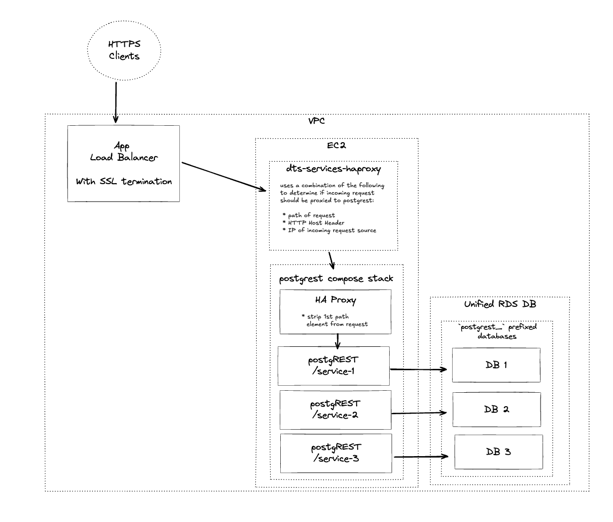

# atd-postgrest

This repository contains configuration files for orchestrating Austin Transportation's [PostgREST](https://postgrest.org/) services.

## Design

ATD relies on multiple postgREST services. These services are fronted by a single [HAProxy](http://www.haproxy.org/) server, which routes requests to each postgREST instance. 

The root endpoint is available at [http://atd-postgrest.austinmobility.io/](http://atd-postgrest.austinmobility.io/).

Each postgREST service must be defined in `docker-compose.yaml`

## Configuration

### Environment variables

Because each of the services's databases are hosted in the same RDS cluster, the following environment variables are applied to all postgREST services.

- `PG_HOST`: the postgres server host name
- `PG_USER`: the postgres user name
- `PG_PASSWORD`: the postgres password
- `PGREST_MAX_ROWS=1000`: the maximum rows to be returned by a postgREST request

As well, each postgREST service requires a unique (32-char minimum) JWT secret. The var can be named as you whish, and must be referenced in `docker-compose.yaml` (look there for example).

